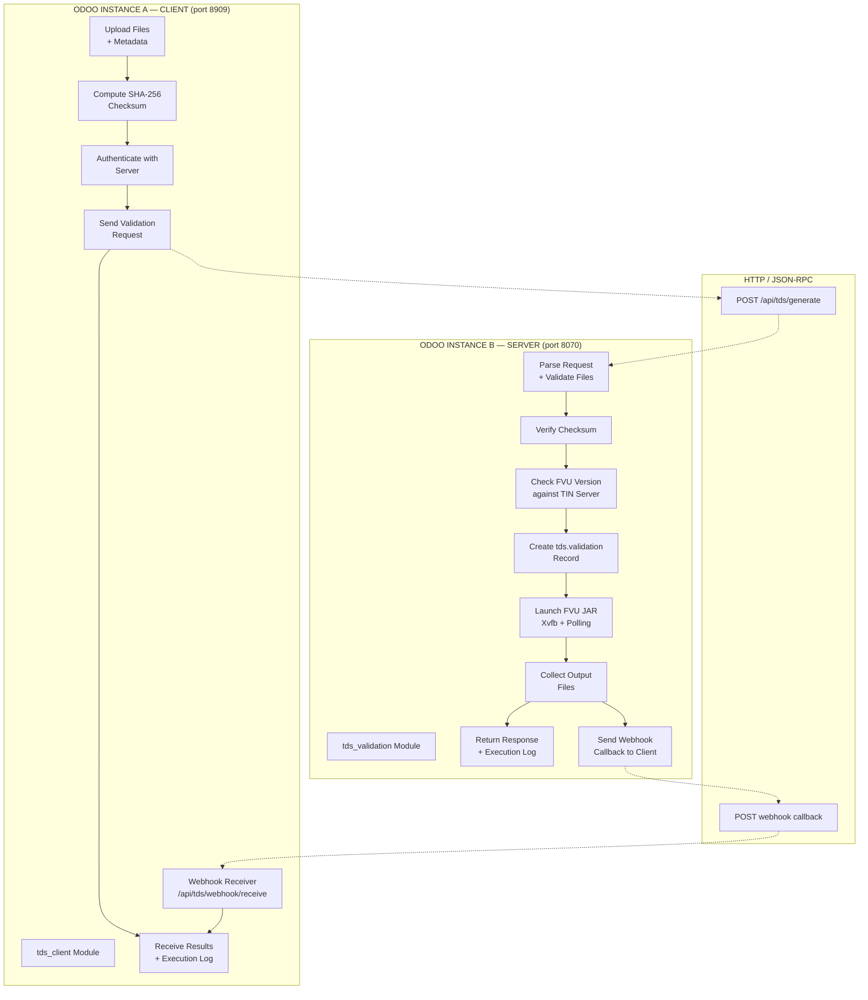
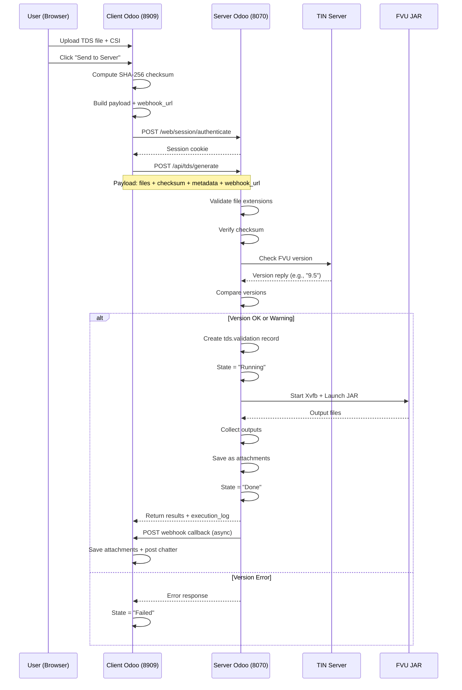
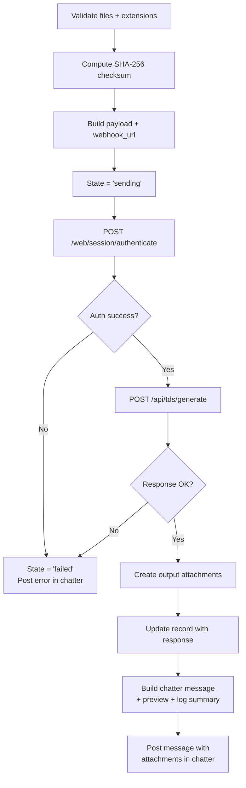
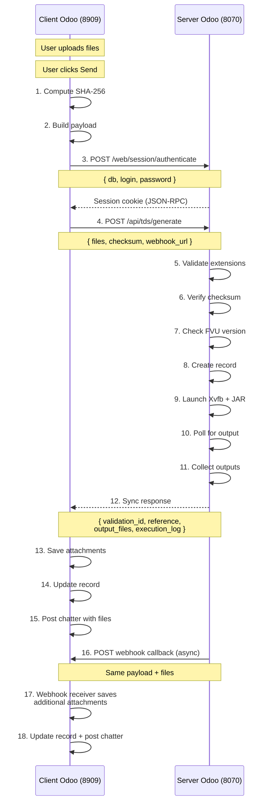
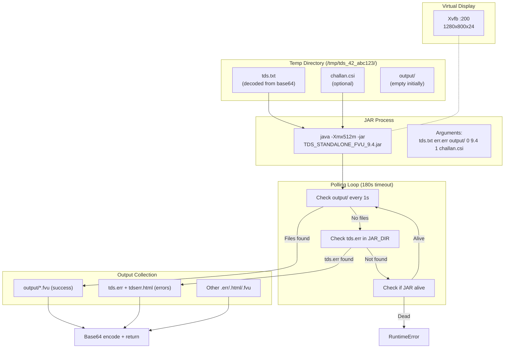
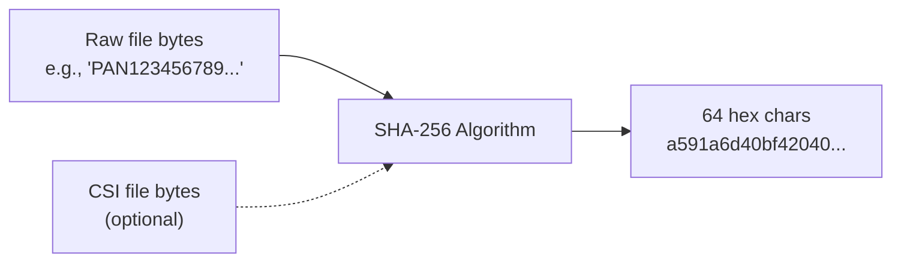
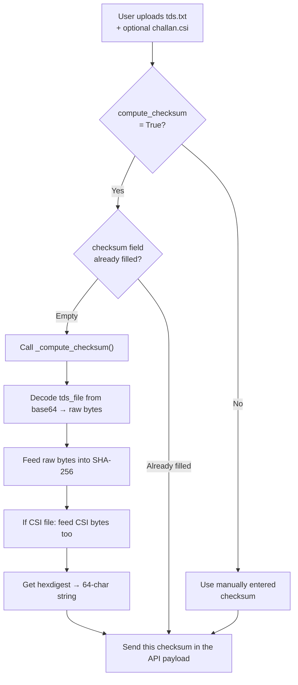
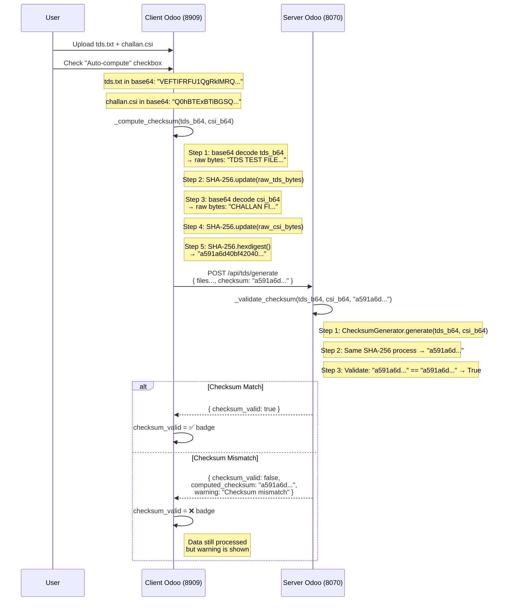

# TDS Validation — Client/Server Architecture

## Complete Code Overview with Flow Diagrams

---

## 1. High-Level Architecture



---

## 2. Module Structure

### Server Module (`tds_validation/` — port 8070)

```
tds_validation/
├── __init__.py                  # Package init
├── __manifest__.py              # Module manifest
│
├── models/
│   ├── __init__.py
│   └── tds_validation.py        # Core Odoo model
│
├── services/
│   ├── __init__.py
│   ├── fvu_runner.py            # FVU JAR runner
│   ├── version_checker.py       # FVU version check
│   ├── checksum_generator.py    # SHA-256 checksum
│   ├── validation_service.py    # Pre-validation
│   └── log_service.py           # Execution log
│
├── controllers/
│   ├── __init__.py
│   └── tds_controller.py        # REST API
│
├── views/
│   └── tds_validation_views.xml  # UI views
│
├── security/
│   └── ir.model.access.csv       # Access rights
│
└── data/
    └── ir_config_parameter.xml   # Config defaults
```

### Client Module (`tds_client/` — port 8909)

```
tds_client/
├── __init__.py                   # Package init
├── __manifest__.py               # Module manifest
│
├── models/
│   ├── __init__.py
│   └── tds_client.py             # Client model
│
├── controllers/
│   ├── __init__.py
│   └── webhook_controller.py     # Webhook receiver
│
├── views/
│   └── tds_client_views.xml      # UI views
│
├── security/
│   └── ir.model.access.csv       # Access rights
│
└── data/
    └── ir_config_parameter.xml   # Config defaults
```

---

## 3. Request/Response Flow



---

## 4. Server Module — Line-by-Line Explanation

### 4.1 `models/tds_validation.py` — Core Model

```python
import logging
import os
import requests                     # HTTP client for webhook callbacks

from odoo import api, models, fields
from odoo.exceptions import UserError, ValidationError
from ..services.fvu_runner import FVURunner      # JAR runner service
from ..services.version_checker import FVUVersionChecker  # Version check
from ..services.log_service import ExecutionLogger         # Execution log

_logger = logging.getLogger(__name__)

VALID_TDS_EXTENSIONS = {'.txt', '.fvu'}   # Allowed TDS file types
VALID_CSI_EXTENSION = '.csi'              # Allowed challan file type
```

**Model definition and fields:**

- `_name = 'tds.validation'` — Database table
- `_inherit = ['mail.thread']` — Chatter support for message history
- **State machine**: `draft → running → done | failed`
- **Input fields**: `tds_file` (Binary), `tds_filename`, `consolidate_file`, `consolidate_filename`
- **Output fields**: `output_attachment_ids` (Many2many to ir.attachment), `error_message`
- **API fields**: `request_id`, `request_date`, `notes`, `checksum`, `checksum_valid`
- **Webhook fields**: `webhook_url`, `webhook_sent`
- **Execution log**: `execution_log` (Text) — full timestamped log
- **Version tracking**: `fvu_version_local`, `fvu_version_server`, `fvu_version_status`

**Key methods:**

| Method                    | Purpose                                             |
| ------------------------- | --------------------------------------------------- |
| `_get_jar_dir()`          | Reads JAR path from System Parameters               |
| `action_run_validation()` | Main entry point — orchestrates the full validation |
| `_check_fvu_version()`    | Calls TIN server to verify FVU version              |
| `_send_webhook()`         | POSTs results to client's webhook URL               |
| `action_reset()`          | Resets failed record back to draft                  |

**`action_run_validation()` flow:**

```
1. Init ExecutionLogger with record ID
2. Check state != 'running'
3. Validate files exist and extensions are valid
4. Log checksum status if provided
5. Run version check → blocks on major mismatch
6. Set state = 'running' + commit DB
7. Create FVURunner → run JAR:
   a. Create temp directory
   b. Write input files (decode from base64)
   c. Start Xvfb (virtual display)
   d. Launch Java JAR with clean env
   e. Poll for output files
   f. Collect output files
8. Save outputs as ir.attachment records
9. Set state = 'done'
10. Send webhook if URL configured
11. On error: set state = 'failed', save error message
12. Always: cleanup temp dir + kill processes
```

---

### 4.2 `services/fvu_runner.py` — FVU JAR Runner

This is the most complex service — it runs a Java Swing GUI application **headlessly**.

**Key components:**

| Component               | Purpose                                               |
| ----------------------- | ----------------------------------------------------- |
| `_detect_jar_info()`    | Scans JAR directory for `TDS_STANDALONE_FVU_*.jar`    |
| `_clean_orphan_temps()` | Cleans temp dirs >24h old from crashed runs           |
| `FVURunner.__init__()`  | Initializes with record ID, JAR dir, execution logger |
| `run()`                 | Main method — executes the pipeline                   |
| `cleanup()`             | Kills processes + deletes temp directory              |

**`run()` flow:**

```
1. Create temp dir: /tmp/tds_{id}_{random}/
2. Write input files (decode base64 → raw bytes)
3. Start Xvfb on free display (:200+)
4. Build clean environment (bypasses Snap GLib crashes)
5. Launch Java JAR with arguments:
   java -Xmx512m ... -jar TDS_STANDALONE_FVU_9.4.jar \
     <tds_file> <err_file> <output_dir/> 0 <version> 1 <consolidate>
6. Poll for output files (every 1s, max 180s)
7. Kill JAR as soon as output detected
8. Collect outputs from:
   - output/ directory (success .fvu files)
   - JAR directory (tds.err, tdserr.html)
   - temp root (other .err/.html/.fvu files)
```

**Why Xvfb?** The FVU JAR is a Java Swing GUI app that needs a display to render. Xvfb (X Virtual Framebuffer) provides a virtual display without a physical monitor.

**Clean environment fix:** The Snap/VS Code runtime sets environment variables that crash GLib. The fix builds a fresh environment with only `HOME`, `USER`, `LANG`, plus `GIO_MODULE_DIR` pointing to an empty directory.

---

### 4.3 `services/version_checker.py` — Version Check

```python
VERSION_URL = 'https://onlineservices.tin.egov.proteantech.in/TIN/checkfvuversion.do'
```

**Flow:**

```
1. Detect local version from JAR filename (regex: FVU_9.4)
2. POST to TIN server with fvu_version=1
3. Parse response: "9.5^2.191^2.1321^1.1" → version is "9.5"
4. Compare local vs server:
   - Major mismatch (9 vs 10) → BLOCK validation
   - Minor outdated (9.4 vs 9.5) → WARN + continue
   - Current → OK
   - Server unreachable → ERROR + block
```

---

### 4.4 `services/log_service.py` — ExecutionLogger

```python
class ExecutionLogger:
    """Captures timestamped logs for each validation run."""
```

**Methods:**

| Method                 | Emoji | Output                                 |
| ---------------------- | ----- | -------------------------------------- |
| `section(title)`       | —     | Visual heading with dashes             |
| `info(msg)`            | —     | Informational message                  |
| `ok(msg)`              | ✅    | Success message                        |
| `warn(msg)`            | ⚠     | Warning message                        |
| `error(msg)`           | ❌    | Error message                          |
| `detail(label, value)` | ·     | Key-value pair                         |
| `persist(record)`      | —     | Writes log to DB's execution_log field |

Each method does **dual logging** — stores in memory AND writes to Odoo server log.

---

### 4.5 `services/checksum_generator.py` — SHA-256

```python
def generate(tds_b64, csi_b64=None):
    sha = hashlib.sha256()
    sha.update(base64.b64decode(tds_b64))     # Hash raw file bytes
    if csi_b64:
        sha.update(base64.b64decode(csi_b64)) # Include CSI file
    return sha.hexdigest()

def validate(tds_b64, csi_b64, expected):
    computed = generate(tds_b64, csi_b64)
    return computed.lower() == expected.lower()
```

---

### 4.6 `services/validation_service.py` — Pre-validation

Checks:

- Filename exists and has valid extension (`.txt`, `.fvu`, `.csi`)
- Base64 content decodes correctly and is non-empty
- Metadata: `request_id` is string, `request_date` is YYYY-MM-DD

### 4.7 `controllers/tds_controller.py` — API Endpoint

**Route:** `POST /api/tds/generate`

**Parameters:**
| Field | Required | Description |
|-------|----------|-------------|
| `tds_file_b64` | ✅ | Base64-encoded TDS file |
| `tds_filename` | ✅ | Original filename |
| `csi_file_b64` | ❌ | Base64-encoded challan file |
| `csi_filename` | ❌ | Original CSI filename |
| `checksum` | ❌ | SHA-256 hex string |
| `request_id` | ❌ | External reference ID |
| `webhook_url` | ❌ | Callback URL for results |

**Processing steps:**

```
1. Parse JSON-RPC parameters
2. Validate required fields + extensions
3. Validate checksum (if provided)
4. Create tds.validation record
5. Call action_run_validation()
6. Collect output files from attachments
7. Collect execution_log
8. Return { status, message, data }
```

---

### 4.8 `views/tds_validation_views.xml` — UI

**Form view fields:**

- Input Files (binary uploads)
- API / Integration (request_id, checksum, webhook_url, webhook_sent)
- FVU Version Check (local version, server version, status badge)
- Error Details (shown on failure)
- Execution Log (full step-by-step log)
- Output Files (downloadable attachments)

**List view columns:**

- Reference, filename, FVU version, version status, state badge, created date

---

## 5. Client Module — Line-by-Line Explanation

### 5.1 `models/tds_client.py` — Client Model

**Key fields:**

| Field                                                           | Purpose                               |
| --------------------------------------------------------------- | ------------------------------------- |
| `tds_file` / `csi_file`                                         | Input files (Binary)                  |
| `compute_checksum`                                              | Auto-compute SHA-256 checkbox         |
| `checksum` / `checksum_valid`                                   | Checksum and server validation status |
| `auto_webhook` / `webhook_url`                                  | Webhook configuration                 |
| `server_url` / `server_login` / `server_password` / `server_db` | Server connection                     |
| `timeout`                                                       | Request timeout (default 300s)        |
| `server_state` / `server_reference` / `server_validation_id`    | Server response info                  |
| `output_attachment_ids`                                         | Output files from server              |
| `execution_log`                                                 | Server's execution log                |
| `raw_response`                                                  | Full JSON response                    |
| `response_time`                                                 | Elapsed time                          |

**`action_send_to_server()` flow:**



**Webhook URL auto-computation:**

```python
if self.auto_webhook and not webhook_url:
    import socket
    ip = socket.gethostbyname(socket.gethostname())
    webhook_url = f'http://{ip}:8909/api/tds/webhook/receive'
```

---

### 5.2 `controllers/webhook_controller.py` — Webhook Receiver

**Route:** `POST /api/tds/webhook/receive` (auth='public')

**Purpose:** Receives an asynchronous POST from the server when validation completes, containing output files and execution log.

**How it works:**

```
1. Parse incoming JSON payload
2. Find matching tds.client record by request_id or validation_id
3. Create ir.attachment records for each output file
4. Update client record with:
   - state, server_state, server_reference
   - server_validation_id, execution_log
   - checksum_valid, error_message
   - output_attachment_ids (append to existing)
5. Post chatter message with summary
```

**Payload structure:**

```json
{
  "event": "validation.complete",
  "validation_id": 123,
  "reference": "TDS/2026/0001",
  "state": "done",
  "request_id": "REQ-001",
  "checksum": "1a70432e...",
  "checksum_valid": true,
  "execution_log": "[05:56:11] === TDS Validation START...",
  "output_files": [
    { "name": "tds.err", "b64": "..." },
    { "name": "tdserr.html", "b64": "..." }
  ]
}
```

---

### 5.3 `views/tds_client_views.xml` — UI

**Form view layout:**

```
Header: [🚀 Send to Server] [Reset to Draft] [State Statusbar]
─────────────────────────────────────────────────
Reference (auto-numbered)

Input Files:
  - TDS/TCS Input File (.txt/.fvu) — binary upload
  - Challan File (.csi) — optional binary upload

Checksum:
  ☑ Auto-compute Checksum
  Checksum: 1a70432e...
  Checksum Valid: [✅/❌ badge]

Metadata:
  Request ID, Request Date, Notes

Webhook:
  ☑ Auto Register Webhook
  Webhook URL: http://192.168.1.100:8909/...

Server Connection:
  Server URL, Login, Password, Database, Timeout

Server Response: (visible when done/failed)
  Server State, Reference, Validation ID, Response Time
  [📄 View Raw Response] button

Error Details: (visible on failure)
Chatter: (messages with file attachments)
```

---

## 6. Complete Communication Sequence



---

## 7. FVU JAR Execution Detail



---

## 8. Checksum — Complete Deep Dive

### 8.1 What is a Checksum?

A **checksum** is a fixed-length string (fingerprint) computed from file content. If even one byte of the file changes, the checksum changes completely. Think of it like a **digital fingerprint**:

```
"Hello World" → SHA-256 → a591a6d40bf420404a011733cfb7b190d62c65bf0bcda32b57b277d9ad9f146e
"Hello WorlD" → SHA-256 → 487c6444c1dadbb4b40cf1b3a2d1a9d3e5faee5c5696c3e3b5c5b7a4f9d2e8f1
```

Just one letter capitalization changed → completely different hash.

### 8.2 Why Use a Checksum in TDS Validation?

| Purpose                | Why It Matters                                                                                                                       |
| ---------------------- | ------------------------------------------------------------------------------------------------------------------------------------ |
| **Data integrity**     | Ensure the .txt/.fvu file wasn't corrupted during upload or API transfer (base64 encoding/decoding errors, network truncation)       |
| **Tamper detection**   | If someone modifies the file between client and server, the checksum won't match                                                     |
| **Multi-file binding** | When both a .txt and a .csi file are sent, the checksum covers BOTH files — so you can verify they belong together as a matched pair |
| **Audit trail**        | The checksum is stored on both client and server records, providing proof of exactly what was submitted                              |

### 8.3 How SHA-256 Works (Step by Step)



```
Step 1: Take the raw bytes of the file (e.g., tds.txt content)
Step 2: Feed them into SHA-256 algorithm
Step 3: Algorithm produces a 256-bit hash (64 hex characters)

If a CSI file is attached:
Step 4: Feed CSI file bytes into the SAME hash after TDS bytes
Step 5: Final hash now represents "both files as one"
```

### 8.4 The Implementation — Three Locations

The checksum logic exists in **three places** that work together:

#### A. Client Side: `tds_client/models/tds_client.py` — `_compute_checksum()`

```python
@staticmethod
def _compute_checksum(tds_b64, csi_b64=None):
    sha = hashlib.sha256()           # Create a new SHA-256 hash object

    # Step 1: Decode the base64 TDS file back to raw bytes
    try:
        tds_raw = base64.b64decode(tds_b64)   # "base64..." → actual bytes
        sha.update(tds_raw)                    # Feed raw bytes into hash
    except Exception:
        sha.update(tds_b64.encode('utf-8'))    # Fallback: hash the string itself

    # Step 2: If a CSI file exists, include it too
    if csi_b64:
        try:
            csi_raw = base64.b64decode(csi_b64)
            sha.update(csi_raw)                 # Append CSI bytes to the same hash
        except Exception:
            sha.update(csi_b64.encode('utf-8'))

    # Step 3: Get the final 64-character hex string
    return sha.hexdigest()                     # "a591a6d40bf42040..."
```

**Where it runs:** When the user clicks "Send to Server"

**Flow:**



#### B. Server Side Controller: `tds_validation/controllers/tds_controller.py` — `_validate_checksum()`

```python
def _validate_checksum(self, tds_b64, csi_b64, input_checksum):
    # Delegate to the ChecksumGenerator service
    from ..services.checksum_generator import ChecksumGenerator
    validator = ChecksumGenerator()
    return validator.validate(tds_b64, csi_b64, input_checksum)
```

**This is called BEFORE creating the validation record.** If checksum doesn't match:

- The validation still proceeds (checksum mismatch is a **warning, not a block**)
- The `warning` field in the response tells the client there's a mismatch
- The computed checksum is returned so the client can see what it SHOULD be

#### C. ChecksumGenerator Service: `tds_validation/services/checksum_generator.py`

```python
class ChecksumGenerator:

    @staticmethod
    def generate(tds_b64, csi_b64=None):
        """Generate SHA-256 checksum (EXACT same algorithm as client)."""
        sha = hashlib.sha256()

        tds_raw = base64.b64decode(tds_b64)
        sha.update(tds_raw)               # Hash TDS bytes

        if csi_b64:
            csi_raw = base64.b64decode(csi_b64)
            sha.update(csi_raw)            # Append CSI bytes

        return sha.hexdigest()             # → "a591a6d40bf42040..."

    @staticmethod
    def validate(tds_b64, csi_b64, expected_checksum):
        computed = ChecksumGenerator.generate(tds_b64, csi_b64)
        return computed.lower() == expected_checksum.lower()
        # Returns True → match (data is intact)
        # Returns False → mismatch (data may be corrupted)
```

**Critical detail:** The algorithm MUST be identical on client and server — otherwise every check would fail. Both use:

1. `base64.b64decode()` to get raw bytes
2. `hashlib.sha256()` to create the hash
3. `.update()` for TDS bytes, then `.update()` for CSI bytes
4. `.hexdigest()` to get the final string

### 8.5 Complete Checksum Flow (End to End)



### 8.6 What Gets Hashed — Visual Example

```
Input Files:
  tds.txt  →  "TDS TEST FILE CONTENT HERE"
  challan.csi  →  "CHALLAN FILE CONTENT HERE"

What SHA-256 Actually Receives:
  "TDS TEST FILE CONTENT HERE" + "CHALLAN FILE CONTENT HERE"
  → (concatenated as raw bytes, then hashed as one stream)

Output:
  a591a6d40bf420404a011733cfb7b190d62c65bf0bcda32b57b277d9ad9f146e
```

If someone:

- Changes one character in tds.txt → **different checksum**
- Reorders the files → **same checksum** (order is fixed: TDS first, CSI second)
- Forgets to upload CSI on one side → **different checksum** (because hash includes CSI bytes)

### 8.7 Why It's Non-Blocking

The checksum is a **validation**, not a **gate**. Even if checksums don't match, the FVU JAR still runs on the server. This is intentional because:

1. **The checksum is optional** — the client may not know how to compute it
2. **The FVU JAR validates the file format itself** — it will reject corrupt files on its own
3. **The user needs the output files regardless** — a corrupt file produces error files (tds.err, tdserr.html) that explain the problem
4. **The mismatch is logged and reported** — the client chatter shows "Checksum: INVALID ✗" with the expected checksum, so the user can debug

The only scenario where it **would** block is if we added a `if not checksum_valid: raise UserError(...)` — but we chose to make it informational.

### 8.8 UI Indicators

| State                 | Client Badge                         | Server Badge                                |
| --------------------- | ------------------------------------ | ------------------------------------------- |
| Checksum valid ✅     | Green badge `checksum_valid == True` | Green field `checksum_valid = True`         |
| Checksum invalid ❌   | Red badge `checksum_valid == False`  | Red field `checksum_valid = False`          |
| No checksum sent      | Grey/no badge                        | `checksum_valid = False`, field shows empty |
| Auto-compute enabled  | ☑ checkbox checked                   | —                                           |
| Auto-compute disabled | ☐ checkbox unchecked                 | —                                           |

---

## 9. Demo Mode (for testing without real JAR)

The code previously had a demo mode (`TDS_DEMO_MODE=1`) that created fake output files. This has been **removed** from production. The current code only runs with the real FVU JAR.

---

## 10. Configuration Parameters

### Server (`tds_validation`)

| Key                      | Default                                       | Purpose          |
| ------------------------ | --------------------------------------------- | ---------------- |
| `tds_validation.jar_dir` | `/home/odoo/Downloads/TDS_STANDALONE_FVU_9.4` | FVU JAR location |

### Client (`tds_client`)

| Key                          | Default                 | Purpose                |
| ---------------------------- | ----------------------- | ---------------------- |
| `tds_client.server_url`      | `http://localhost:8070` | Server URL             |
| `tds_client.server_login`    | `admin`                 | Server login           |
| `tds_client.server_password` | `admin`                 | Server password        |
| `tds_client.server_db`       | `rd-TDS`                | Server database        |
| `tds_client.timeout`         | `300`                   | HTTP timeout (seconds) |

---

## 10. Data Flow Summary

```
User uploads files in Client Odoo (port 8909)
        │
        ▼
Client computes SHA-256 checksum
Client builds JSON-RPC payload
Client authenticates with Server (port 8070)
        │
        ▼
POST /api/tds/generate
{
  tds_file_b64, tds_filename,
  csi_file_b64?, csi_filename?,
  checksum, request_id,
  webhook_url
}
        │
        ▼
Server validates:
  1. File extensions (.txt/.fvu, .csi)
  2. SHA-256 checksum match
  3. FVU version (TIN server check)
        │
        ▼
Server executes:
  1. Creates tds.validation record
  2. Starts Xvfb (virtual display)
  3. Launches Java FVU JAR
  4. Polls for output files (180s max)
  5. Collects outputs
  6. Creates ir.attachment records
  7. Sets state = 'done'
        │
        ▼
Sync response to Client:
{
  validation_id, reference, state,
  output_files: [{name, b64}],
  execution_log: "full log...",
  checksum_valid
}
        │
        ▼
Client:
  1. Creates output attachments
  2. Updates record with response
  3. Posts chatter message with:
     - Summary + preview
     - File attachments (downloadable)
     - Execution log summary
        │
        ▼
Async webhook (optional):
Server → POST → Client /api/tds/webhook/receive
{
  Same payload + output_files
}
Client webhook controller:
  1. Finds matching record
  2. Saves additional attachments
  3. Updates record
  4. Posts chatter message
```

---

## 11. Server Startup

```bash
# Server (port 8070) — must have the FVU JAR
./odoo-bin --addons-path="addons/,../enterprise/,../tutorials" \
  -d rd-TDS --http-port=8070 \
  --limit-time-real=9999 --limit-time-cpu=9999
```

```bash
# Client (port 8909) — standalone, no JAR needed
./odoo-bin --addons-path="addons/,../enterprise/,../tutorials" \
  -d rd-TDS --http-port=8909 \
  --limit-time-real=9999 --limit-time-cpu=9999
```
